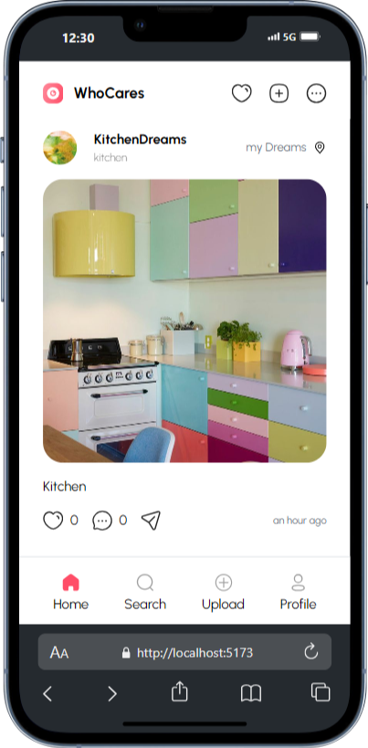

# "WhoCares" Social Media Application

Hier ein Video

<div style="display: flex; justify-content: space-between; align-items: center; width: 100%">
    
</div>

The WhoCares Application presents a social media platform that allows its users to create personalized profiles and share photos and their thoughts connected to them. Users are able to engage in the community by following each other, liking and commenting on other people's posts, as well as revisiting the posts they liked by viewing them in the favorites page.

The application was created as a group effort of four at the final of our 6-month long Frontend Web Development Bootcamp, using React in the Front- and Supabase in the Backend.  

## Table of Contents 

- [About the Project](#about-the-project)
  - [Features](#features)
  - [Teamwork](#teamwork)
- [Tech Stack](#tech-stack)
- [Getting Started](#getting-started)
  - [Prerequisites](#prerequisites)
  - [Installation](#installation)
- [Design](#design)
- [Deployment](#deployment)

## About the Project

### Features

Login & SignUp:
- Create a new profile with a username, email and password. After successful registration you are automatically signed in.
- Login with your password and either your username or email

Home:
- View the most recently added posts in the community chronologically
- Load more posts if desired
- Links to the respective user profiles via their names in the post above the photo

Posts on all pages:
- Option to like and unlike posts
- Open a comment modal window by tapping the speech bubble
- - View all comments, post a comment and option to delete after posting
- Relative timestamp of upload

Profiles:
- Info display about the user
- Counters for the numbers of uploaded posts, followers and other profiles the user follows
- Posts can be displayed as miniatures in a grid or in a larger format underneath each other
- Tap on a miniature image to open it in a larger view window including its details
- Your profile:
- - In your own profile, tap on the pencil icon to update your profile image and data in
- - Edit or delete your posts in the large view window
- Other's profiles:
- - Follow and unfollow users

Post a New Photo:
- Use the camera to take a photo or upload an image from your device
- Add an optional photo description and location info

Search:
- Browse through users by username
- Visit their profile by the link in their name and profile picture

Settings:
- Option to Log Out

### Teamwork
This project was carried out as a team effort of four. We communicated regularly via Discord to coordinate development progress. In addition, we used Figma as a tool to visualize our tasks and progress. Using Git as a version control tool, we made sure that all changes were merged, pushed and pulled to ensure a smooth process.

## Tech Stack

**Markup:**  
  

**Styling:**  

 

**JS Library:**  
  

**Backend Database:**  
  

**Programming Language:**  
  

**Routing**  
  

**IDE:**  
  

**Version Control:**  
  


## Getting Started

Here is a guide on how to set up and run the WhoCares Social Media project on your local computer:

### Prerequisites

You should have the following programs installed:

- [Git](https://git-scm.com/)
- [VS Code](https://code.visualstudio.com/download)
- [Vite](https://v5.vite.dev/guide/)

### Installation

1. **Clone das "Repository":**
   ```bash
   git clone https://github.com/bebzbzbz/TokTok
   ```

2. **Install dependencies & run the development server:**
   ```bash
   npm install
   npm run dev
   ```

3. **Open your local host and have fun posting! 📸** 

## Design

The design of the project is based on a Figma template, which serves as the basis for the layout and color palette to ensure a consistent and appealing user interface. The design was developed with a mobile-first approach and provides a user-friendly interface for smartphones.

## Deployment

Click here to go directly to the project's deployment website
- [WhoCares Community](https://who-cares-community.vercel.app/)